  

  &nbsp;
  &nbsp;
  

### 👋 About me

I'm a software engineering student at **Al-Azhar University – Gaza**, working where AI meets real product work — and where code turns into motion.

- 🤖 **Now** — building the AI layer of **Workflow**: in-product AI modules and n8n flows that take over recurring project & team-management work
- 🧩 **Shipped** — the Python & AI side of **Masar**, an enterprise management platform, with a six-member team at TAQAT Academy (final evaluation **99.6%**)
- 🎬 **Creative web** — Three.js / WebGL front-ends with custom GLSL shaders, like the scroll hero of the **Frameline** studio site
- 📸 **Beyond code** — photography, editing and technical writing in **English & Arabic** for international media and NGOs

### 🚀 Featured work

  

  &nbsp;
  

### 🛠️ Tech I build with

  

also: n8n automation · LLM-powered features · GLSL shaders · REST APIs · relational data modelling

 

  

